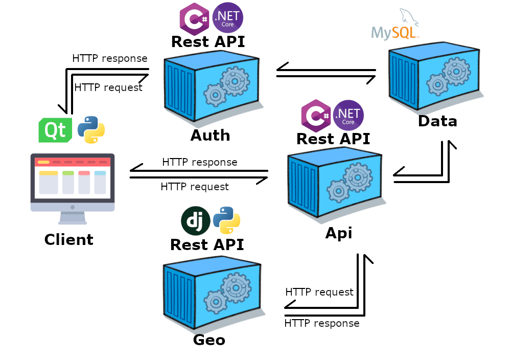

<h6 align="center">
  <a href="https://drawprogram.org/">DrawCAD |</a>
  <a href="https://drawprogram.org/Home/DrawCAD">Doc |</a>
  <a href="https://drawprogram.org/Home/DrawApi">Api |</a>
  <a href="https://drawprogram.org/Home/DrawGeo">Geo |</a>
  <a href="https://drawprogram.org/Home/DrawAuth">Auth</a>
</h6>

